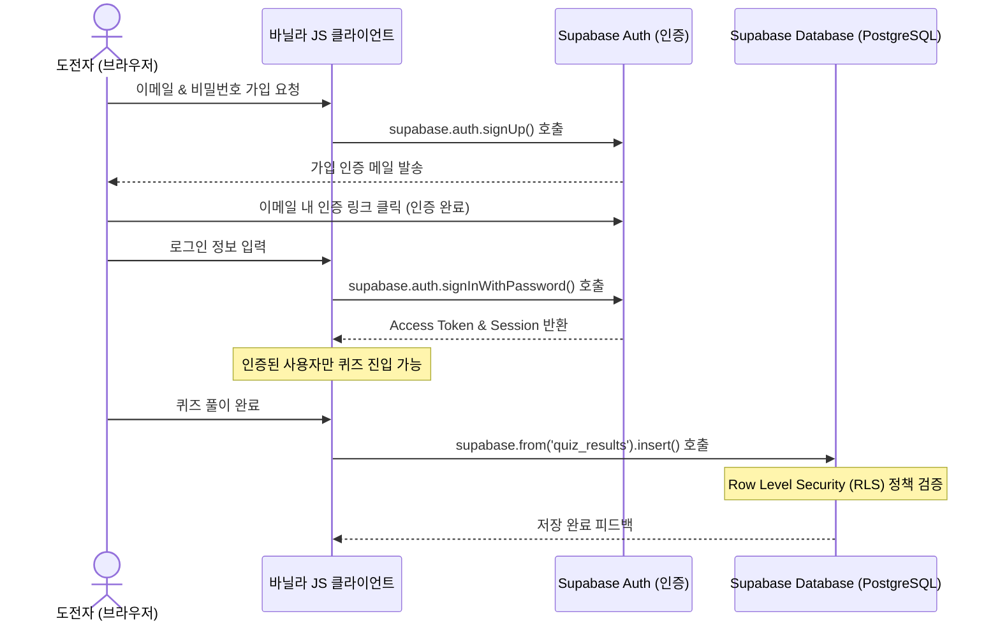

# Supabase 백엔드 마이그레이션 가이드 (SUPABASE.md)

본 문서는 현재 바닐라 HTML/CSS/JS로 구현된 퀴즈 웹사이트에 **Supabase 백엔드**를 연동하여, 이메일 회원가입/인증을 마친 사용자만 퀴즈를 풀고 결과를 DB에 영구 기록하도록 전환하기 위해 필요한 모든 설계와 가이드라인을 다룹니다.

---

## 1. 시스템 아키텍처 및 흐름도



---

## 2. Supabase 콘솔 준비 작업 (사용자 액션 아이템)

Supabase 계정이 아직 없는 상태이므로 다음 순서대로 클라우드 콘솔 작업을 수행하셔야 합니다.

### Step 2.1. Supabase 가입 및 프로젝트 생성
1. [Supabase 공식 홈페이지](https://supabase.com)에 접속하여 회원가입(GitHub 계정 연동 권장)을 진행합니다.
2. 콘솔에서 **`New Project`** 버튼을 클릭하여 새 프로젝트를 생성합니다.
   - **Name**: `webdev-trivia-quiz`
   - **Database Password**: 안전한 비밀번호 입력 (잊지 않도록 기록)
   - **Region**: 사용자에게 가까운 `Seoul (ap-northeast-2)` 선택
   - **Pricing Plan**: `Free` 선택
3. 프로젝트 생성이 완료될 때까지 약 1~2분 대기합니다.

### Step 2.2. API 키 및 URL 확인
프로젝트 대시보드의 **`Project Settings`** ➔ **`API`** 메뉴에서 아래 두 가지 값을 복사해 둡니다. 이 값들은 바닐라 JS 소스 코드 내 클라이언트 초기화에 사용됩니다.
- **Project URL** (예: `https://xxxxxx.supabase.co`)
- **API Key (anon/public)** (예: `eyJhbGciOiJIUzI1NiIsInR...`)

### Step 2.3. 이메일 인증(Auth) 설정 확인
기본적으로 Supabase는 이메일 가입 시 실제 이메일 주소를 검증하는 **Email Confirmation** 기능이 켜져 있습니다.
- **인증 설정 경로**: **`Authentication`** ➔ **`Providers`** ➔ **`Email`**
- **인증 메일 확인 설정**: `Confirm email` 옵션이 켜져(`true`) 있는지 확인합니다. 이 옵션이 켜져 있으면 사용자가 가입 후 수신함에서 링크를 클릭해야 로그인이 활성화됩니다.
- **테스트용 간편 가입 설정 (선택 사항)**: 빠른 개발/테스트를 원하시면 `Confirm email`을 일시적으로 꺼서 이메일 인증 링크 클릭 절차 없이 즉시 가입 완료 처리되도록 할 수도 있습니다.

### Step 2.4. 비밀번호 재설정(찾기) 리다이렉트 URL 등록
이메일 재설정 링크를 클릭했을 때 앱으로 정상적으로 돌아오려면 리다이렉트 허용 목록에 앱 주소를 등록해야 합니다.
- **설정 경로**: **`Authentication`** ➔ **`URL Configuration`**
- **Redirect URLs**에 로컬 테스트 주소(예: `http://localhost:8000`)와 배포 주소를 모두 추가합니다.

### Step 2.5. 데이터베이스 테이블 생성 (SQL Editor 사용)
Supabase의 SQL Editor 메뉴로 이동하여 **`New Query`**를 누른 뒤, 아래 SQL 스크립트를 복사-붙여넣기하고 **`RUN`** 버튼을 눌러 테이블을 생성합니다.

```sql
-- 1. 사용자 추가 정보 기록 테이블 (Auth 유저와 1:1 관계)
create table public.profiles (
  id uuid references auth.users on delete cascade primary key,
  username text not null unique, -- 중복 방지를 위해 unique 추가
  created_at timestamp with time zone default timezone('utc'::text, now()) not null
);

-- 2. 퀴즈 결과 점수 기록 테이블
create table public.quiz_results (
  id bigint generated by default as identity primary key,
  user_id uuid references auth.users on delete cascade not null,
  score integer not null default 0,
  correct_ratio text not null, -- 예: "8 / 10"
  answers jsonb not null,       -- 선택한 답변 배열 백업
  completed_at timestamp with time zone default timezone('utc'::text, now()) not null
);

-- 3. 실시간 동기화를 위한 테이블 권한 설정 및 RLS(Row Level Security) 활성화
alter table public.profiles enable row level security;
alter table public.quiz_results enable row level security;

-- 4. RLS 정책(Policy) 수립
create policy "사용자는 본인의 프로필을 조회할 수 있다."
  on public.profiles for select using (auth.uid() = id);

create policy "사용자는 본인의 퀴즈 기록을 조회할 수 있다."
  on public.quiz_results for select using (auth.uid() = user_id);

create policy "사용자는 본인의 퀴즈 기록을 생성할 수 있다."
  on public.quiz_results for insert with check (auth.uid() = user_id);

-- 5. 자동 회원가입 트리거 (이메일 인증 대기 단계에서 RLS 위반 차단용)
-- auth.users 테이블에 새 회원이 추가되면 가입 시 입력받은 닉네임 메타데이터를 이용해 profiles에 자동 삽입합니다.
create or replace function public.handle_new_user()
returns trigger as $$
begin
  insert into public.profiles (id, username)
  values (
    new.id,
    coalesce(new.raw_user_meta_data->>'username', '도전자')
  );
  return new;
end;
$$ language plpgsql security definer;

-- 트리거 바인딩
create or replace trigger on_auth_user_created
  after insert on auth.users
  for each row execute procedure public.handle_new_user();

-- 6. 닉네임 중복 여부 확인을 위한 RPC 함수 (보안 정책 상 비로그인 유저도 타인 닉네임 유무 판별 가능하게 함)
create or replace function public.check_username_exists(username_to_check text)
returns boolean as $$
begin
  return exists (
    select 1 from public.profiles where username = username_to_check
  );
end;
$$ language plpgsql security definer;

-- 함수 실행 권한을 anon, authenticated 역할에 부여
grant execute on function public.check_username_exists(text) to anon, authenticated;

-- 7. 회원 탈퇴 시 본인 계정을 직접 삭제할 수 있는 RPC 함수 (security definer 사용)
create or replace function public.delete_user_account()
returns void as $$
begin
  delete from auth.users where id = auth.uid();
end;
$$ language plpgsql security definer;

-- 함수 실행 권한을 authenticated(로그인한 유저) 역할에만 부여
grant execute on function public.delete_user_account() to authenticated;

-- 8. 관리자 플래그 (라이브 퀴즈 진행자 구분용)
alter table public.profiles add column is_admin boolean not null default false;
-- 특정 계정을 관리자로 지정하려면 아래 UPDATE 문의 UUID를 해당 계정의 auth.users.id로 교체 후 1회 수동 실행
-- update public.profiles set is_admin = true where id = '<관리자로_지정할_user_uuid>';

-- 9. 문제 테이블: 관리자가 직접 등록 (OX 또는 4지선다, 문제별 배점 설정)
create table public.questions (
  id bigint generated by default as identity primary key,
  question_type text not null check (question_type in ('OX', 'MULTIPLE')),
  question_text text not null,
  options jsonb not null, -- OX: ["O", "X"] / MULTIPLE: 4개 문자열 배열
  correct_options jsonb not null, -- options 배열 내 정답 인덱스들의 배열 (복수 정답 지원, 예: [0, 2])
  points integer not null check (points >= 0), -- 문제별 배점 (0점 허용)
  created_by uuid references auth.users,
  created_at timestamp with time zone default timezone('utc'::text, now()) not null
);

alter table public.questions enable row level security;

create policy "인증된 사용자는 문제를 조회할 수 있다."
  on public.questions for select to authenticated using (true);

create policy "관리자만 문제를 등록할 수 있다."
  on public.questions for insert to authenticated
  with check (exists (select 1 from public.profiles where id = auth.uid() and is_admin = true));

-- 10. 라이브 퀴즈 활성 문제 상태 테이블 (단일 행으로 운영)
create table public.quiz_state (
  id integer primary key default 1,
  active_question_id bigint references public.questions(id),
  updated_at timestamp with time zone default timezone('utc'::text, now()) not null,
  -- 문제가 비활성화된 뒤에도 참가자 대기 화면에서 "마지막 문제 리뷰"를 보여주기 위해
  -- 비활성화 시에는 지우지 않고 활성화할 때마다만 갱신되는 필드
  last_question_id bigint references public.questions(id),
  last_activated_at timestamp with time zone,
  constraint single_row check (id = 1)
);
insert into public.quiz_state (id, active_question_id) values (1, null);

alter table public.quiz_state enable row level security;

create policy "인증된 사용자는 활성 문제 상태를 조회할 수 있다."
  on public.quiz_state for select
  to authenticated
  using (true);

create policy "관리자만 활성 문제를 변경할 수 있다."
  on public.quiz_state for update
  to authenticated
  using (exists (select 1 from public.profiles where id = auth.uid() and is_admin = true))
  with check (exists (select 1 from public.profiles where id = auth.uid() and is_admin = true));

-- 11. 참가자별 문제 응답 기록 (문제당 1회만 응답 가능, 5분위 점수는 채점 마감 시 갱신)
create table public.quiz_answers (
  id bigint generated by default as identity primary key,
  user_id uuid references auth.users on delete cascade not null,
  question_id bigint references public.questions(id) on delete cascade not null,
  selected_options jsonb not null, -- 선택한 옵션 인덱스 배열 (복수 선택 가능, 시간초과/무응답은 [])
  is_correct boolean not null,
  score_ratio numeric not null default 0 check (score_ratio >= 0 and score_ratio <= 1), -- 복수 정답 문제의 정답 맞춘 비율 (맞춘 정답 수 - 잘못 고른 오답 수) / 전체 정답 수, 0~1로 클램프. 단일 정답 문제는 자연스럽게 0 또는 1이 됩니다.
  activated_at timestamp with time zone not null, -- 응답 시점의 quiz_state.updated_at 스냅샷 (소요시간 계산 기준)
  answered_at timestamp with time zone default timezone('utc'::text, now()) not null,
  points_awarded integer not null default 0,
  unique (user_id, question_id)
);

alter table public.quiz_answers enable row level security;

-- 실시간 답안 분포 및 리더보드 표시를 위해 전체 조회를 허용합니다 (본인 응답만이 아님).
create policy "인증된 사용자는 모든 응답을 조회할 수 있다 (분포/리더보드용)."
  on public.quiz_answers for select to authenticated using (true);

create policy "사용자는 본인 명의로만 응답을 기록할 수 있다."
  on public.quiz_answers for insert with check (auth.uid() = user_id);

-- 12. 문제 마감 시 5분위 채점 함수 (관리자가 다음 문제를 활성화/비활성화하기 직전에 호출)
-- 정답자를 소요시간(answered_at - activated_at) 순으로 5등분해 배점의 100/80/60/40/20%를 부여하고,
-- 여기에 복수 정답 문제의 정답 맞춘 비율(score_ratio)을 추가로 곱해 최종 points_awarded를 계산합니다.
-- score_ratio가 0인(오답/시간초과) 응답은 그룹 계산에서 제외되며 points_awarded는 항상 0으로 유지됩니다.
create or replace function public.finalize_question_scoring(target_question_id bigint)
returns void as $$
declare
  q_points integer;
begin
  if not exists (select 1 from public.profiles where id = auth.uid() and is_admin = true) then
    raise exception '관리자만 채점을 마감할 수 있습니다.';
  end if;

  select points into q_points from public.questions where id = target_question_id;
  if q_points is null then
    return;
  end if;

  with ranked as (
    select id, score_ratio, ntile(5) over (order by (answered_at - activated_at) asc) as quintile
    from public.quiz_answers
    where question_id = target_question_id and is_correct = true
  )
  update public.quiz_answers qa
  set points_awarded = round(
    q_points * ranked.score_ratio * (case ranked.quintile
      when 1 then 1.0 when 2 then 0.8 when 3 then 0.6 when 4 then 0.4 else 0.2 end)
  )
  from ranked
  where qa.id = ranked.id;
end;
$$ language plpgsql security definer;

grant execute on function public.finalize_question_scoring(bigint) to authenticated;

-- 13. 리더보드 뷰 (누적 점수 기준 정렬)
-- quiz_answers를 기준으로 집계하여, 최소 1문제 이상 응답(참여)한 사용자만 리더보드에 노출됩니다.
-- (profiles를 기준으로 LEFT JOIN하면 퀴즈에 한 번도 참여하지 않은 가입자도 0점으로 함께 노출되므로 주의)
-- security_invoker = true: 뷰를 만든 소유자 권한이 아니라 조회하는 사용자 권한/RLS로 실행되도록 강제합니다.
-- (지정하지 않으면 Supabase 보안 린터가 "SECURITY DEFINER view"로 경고합니다.)
create view public.leaderboard with (security_invoker = true) as
select qa.user_id, p.username, sum(qa.points_awarded) as total_score
from public.quiz_answers qa
join public.profiles p on p.id = qa.user_id
group by qa.user_id, p.username
order by total_score desc;

grant select on public.leaderboard to authenticated;

-- 리더보드가 참여자 전원의 닉네임을 보여줄 수 있도록, 인증된 사용자는 모든 프로필의 닉네임을 조회할 수 있게 허용합니다.
-- (security_invoker 뷰는 조회자의 RLS를 그대로 적용받으므로, 이 정책이 없으면 본인 닉네임만 보이게 됩니다.
-- 어차피 기존에도 리더보드를 통해 전체 닉네임이 노출되던 구조라 보안 수준 저하는 아닙니다.)
create policy "인증된 사용자는 리더보드용으로 모든 프로필을 조회할 수 있다."
  on public.profiles for select to authenticated using (true);

-- 14. 문제별 제한시간(초) 컬럼 추가 (기존 문제는 기본값 15초로 채워짐)
alter table public.questions add column time_limit integer not null default 15 check (time_limit > 0);

-- 15. 관리자가 문제를 수정할 수 있도록 UPDATE 정책 추가
create policy "관리자만 문제를 수정할 수 있다."
  on public.questions for update to authenticated
  using (exists (select 1 from public.profiles where id = auth.uid() and is_admin = true))
  with check (exists (select 1 from public.profiles where id = auth.uid() and is_admin = true));

-- 16. 관리자가 문제별 응답 기록을 초기화(삭제)할 수 있도록 DELETE 정책 추가
create policy "관리자만 응답 기록을 삭제할 수 있다."
  on public.quiz_answers for delete to authenticated
  using (exists (select 1 from public.profiles where id = auth.uid() and is_admin = true));

-- 17. 참가자 대기 화면에 표시되는 환영 문구 (관리자가 수정 가능, 단일 행으로 운영)
create table public.app_settings (
  id integer primary key default 1,
  welcome_message text not null default 'HTML, CSS, JavaScript 및 브라우저 아키텍처에 대한 흥미로운 퀴즈가 진행됩니다.',
  updated_at timestamp with time zone default timezone('utc'::text, now()) not null,
  constraint single_row check (id = 1)
);
insert into public.app_settings (id) values (1);

alter table public.app_settings enable row level security;

create policy "인증된 사용자는 환영 문구를 조회할 수 있다."
  on public.app_settings for select to authenticated using (true);

create policy "관리자만 환영 문구를 수정할 수 있다."
  on public.app_settings for update to authenticated
  using (exists (select 1 from public.profiles where id = auth.uid() and is_admin = true))
  with check (exists (select 1 from public.profiles where id = auth.uid() and is_admin = true));

-- 18. [마이그레이션] 이미 leaderboard 뷰를 만든 적이 있다면 아래로 교체 실행하세요.
-- 기존 버전은 profiles 기준 LEFT JOIN이라 퀴즈에 한 번도 참여하지 않은 가입자도 0점으로 노출되는 문제가 있었습니다.
create or replace view public.leaderboard as
select qa.user_id, p.username, sum(qa.points_awarded) as total_score
from public.quiz_answers qa
join public.profiles p on p.id = qa.user_id
group by qa.user_id, p.username
order by total_score desc;

-- 19. [마이그레이션] 참가자 대기 화면의 "마지막 문제 리뷰" 기능을 위한 컬럼 추가
-- (이미 quiz_state 테이블이 있는 경우에만 실행하면 됩니다. 새로 테이블을 만드는 경우 위 9번에 이미 포함되어 있습니다.)
alter table public.quiz_state add column if not exists last_question_id bigint references public.questions(id);
alter table public.quiz_state add column if not exists last_activated_at timestamp with time zone;

-- 20. [마이그레이션] 복수 정답 지원 — questions.correct_option(단일 정수) → correct_options(배열)로 전환
-- 이미 questions 테이블을 만든 적이 있다면 아래를 실행하세요. (새로 테이블을 만드는 경우 위 9번에 이미 반영되어 있습니다.)
alter table public.questions add column if not exists correct_options jsonb;
update public.questions set correct_options = to_jsonb(array[correct_option])
  where correct_options is null;
alter table public.questions alter column correct_options set not null;
alter table public.questions drop column if exists correct_option;

-- 21. [마이그레이션] 복수 정답 지원 — quiz_answers.selected_option(단일 정수, -1=시간초과) → selected_options(배열)로 전환
alter table public.quiz_answers add column if not exists selected_options jsonb;
update public.quiz_answers set selected_options =
  case when selected_option = -1 then '[]'::jsonb else to_jsonb(array[selected_option]) end
  where selected_options is null;
alter table public.quiz_answers alter column selected_options set not null;
alter table public.quiz_answers drop column if exists selected_option;

-- 22. [마이그레이션] 배점 0점 허용 (기존 questions.points > 0 제약 완화)
alter table public.questions drop constraint if exists questions_points_check;
alter table public.questions add constraint questions_points_check check (points >= 0);

-- 23. [마이그레이션] 문제 삭제 기능 지원
-- 23a. 문제 삭제 시 관련 응답 기록도 함께 삭제되도록 FK에 on delete cascade 추가
alter table public.quiz_answers drop constraint if exists quiz_answers_question_id_fkey;
alter table public.quiz_answers add constraint quiz_answers_question_id_fkey
  foreign key (question_id) references public.questions(id) on delete cascade;

-- 23b. 관리자가 문제를 삭제할 수 있도록 DELETE 정책 추가
create policy "관리자만 문제를 삭제할 수 있다."
  on public.questions for delete to authenticated
  using (exists (select 1 from public.profiles where id = auth.uid() and is_admin = true));

-- 24. [마이그레이션] 복수 정답 문제의 "맞춘 비율" 기반 채점 지원
-- quiz_answers에 score_ratio 컬럼을 추가하고, 과거 데이터는 is_correct 기준으로 0 또는 1로 채워 넣습니다.
alter table public.quiz_answers add column if not exists score_ratio numeric not null default 0
  check (score_ratio >= 0 and score_ratio <= 1);
update public.quiz_answers set score_ratio = case when is_correct then 1 else 0 end;

-- finalize_question_scoring 함수를 score_ratio를 반영하도록 재생성 (위 12번 정의로 교체)
create or replace function public.finalize_question_scoring(target_question_id bigint)
returns void as $$
declare
  q_points integer;
begin
  if not exists (select 1 from public.profiles where id = auth.uid() and is_admin = true) then
    raise exception '관리자만 채점을 마감할 수 있습니다.';
  end if;

  select points into q_points from public.questions where id = target_question_id;
  if q_points is null then
    return;
  end if;

  with ranked as (
    select id, score_ratio, ntile(5) over (order by (answered_at - activated_at) asc) as quintile
    from public.quiz_answers
    where question_id = target_question_id and is_correct = true
  )
  update public.quiz_answers qa
  set points_awarded = round(
    q_points * ranked.score_ratio * (case ranked.quintile
      when 1 then 1.0 when 2 then 0.8 when 3 then 0.6 when 4 then 0.4 else 0.2 end)
  )
  from ranked
  where qa.id = ranked.id;
end;
$$ language plpgsql security definer;

-- 25. [마이그레이션] leaderboard 뷰의 "SECURITY DEFINER" 보안 경고 해소
-- 이미 leaderboard 뷰를 만든 적이 있다면 아래를 실행해 조회자 권한(RLS)으로 실행되도록 전환하세요.
alter view public.leaderboard set (security_invoker = true);

-- security_invoker 전환 시 리더보드에서 타인의 닉네임이 사라지지 않도록,
-- 인증된 사용자는 모든 프로필의 닉네임을 조회할 수 있게 허용하는 정책을 추가합니다.
create policy "인증된 사용자는 리더보드용으로 모든 프로필을 조회할 수 있다."
  on public.profiles for select to authenticated using (true);
```

**Realtime 활성화**: Supabase 대시보드에서 `Database` → `Replication`으로 이동해 `quiz_state`와 `quiz_answers` 테이블의 Realtime 토글을 모두 켜주세요 (답안 분포 실시간 표시는 `quiz_answers` INSERT 이벤트 구독이 필요합니다). 또는 SQL Editor에서:
```sql
alter publication supabase_realtime add table public.quiz_state;
alter publication supabase_realtime add table public.quiz_answers;
```

**참고 — 정답 노출 관련**: `questions.correct_option`은 로그인한 모든 사용자가 조회 가능합니다. 기존 클라이언트 하드코딩 방식(`quizData`가 앱 소스에 전부 노출)과 동일한 신뢰 수준이므로 보안 수준 저하는 아닙니다. `quiz_answers` 전체 조회 허용도 실시간 분포/리더보드 기능을 위한 의도된 트레이드오프입니다.

---

## 3. 프론트엔드 연동 가이드 (HTML / JS 변경 사항)

바닐라 JS 환경에서 Supabase를 로드하고 가입/인증 및 데이터 삽입을 수행하기 위한 가이드 코드입니다.

### Step 3.1. CDN 추가 (index.html)
프로젝트 외부 라이브러리 차단 규칙에 따라 기존 앱은 순수 바닐라였지만, 백엔드 연동을 위해 Supabase 공식 SDK CDN을 `<head>` 내에 로드해야 합니다.

```html
<!-- index.html의 head 영역에 Supabase SDK 추가 -->
<script src="https://cdn.jsdelivr.net/npm/@supabase/supabase-js@2"></script>
```

### Step 3.2. 클라이언트 초기화 및 상태 처리 (app.js)
```javascript
// Supabase 클라이언트 초기화
const SUPABASE_URL = "복사해둔_프로젝트_URL";
const SUPABASE_ANON_KEY = "복사해둔_anon_public_키";
const supabase = window.supabase.createClient(SUPABASE_URL, SUPABASE_ANON_KEY);

// 사용자가 가입 시 profiles 테이블에 사용자명을 함께 저장하는 함수 (트리거용 메타데이터 전송)
async function signUpUser(email, password, username) {
  // 닉네임 중복 체크
  const { data: isTaken, error: checkError } = await supabase.rpc('check_username_exists', {
    username_to_check: username
  });
  
  if (checkError) {
    console.error("닉네임 중복 체크 실패:", checkError.message);
  } else if (isTaken) {
    alert("이미 사용 중인 닉네임입니다. 다른 닉네임을 입력해주세요.");
    return;
  }

  // Auth 유저 생성 시 metadata(options.data)에 username 전달
  const { data, error } = await supabase.auth.signUp({
    email: email,
    password: password,
    options: {
      data: {
        username: username
      }
    }
  });

  if (error) {
    let userMessage = "가입 실패: " + error.message;
    if (error.message.includes("Database error saving user profile") || 
        error.message.includes("profiles_username") || 
        error.message.includes("unique constraint")) {
      userMessage = "닉네임 중복으로 회원가입이 되지 않았습니다. 다른 닉네임을 입력해주세요.";
    }
    alert(userMessage);
    return;
  }

  if (data.user) {
    alert("가입 링크가 이메일로 전송되었습니다. 메일함을 확인하고 승인해주세요!");
  }
}

// 이메일 로그인 함수
async function signInUser(email, password) {
  const { data, error } = await supabase.auth.signInWithPassword({
    email: email,
    password: password,
  });

  if (error) {
    alert("로그인 실패: " + error.message);
    return;
  }
  
  // 로그인 후 사용자 세션 복구 및 퀴즈 시작 준비
  console.log("로그인 성공! 유저 UUID:", data.user.id);
}

// 퀴즈 결과 DB 기록 함수
async function saveQuizResult(score, correctCount, answersArray) {
  const { data: { user } } = await supabase.auth.getUser();
  
  if (!user) {
    alert("로그인 세션이 만료되었습니다.");
    return;
  }

  const { error } = await supabase
    .from('quiz_results')
    .insert([
      {
        user_id: user.id,
        score: score,
        correct_ratio: `${correctCount} / 10`,
        answers: answersArray
      }
    ]);

  if (error) {
    console.error("결과 저장 실패:", error.message);
  } else {
    console.log("퀴즈 결과가 Supabase DB에 정상 저장되었습니다.");
  }
}
```

---

## 4. UI/UX 수정 가이드라인
현재 웰컴 화면은 단순히 도전자 이름만 입력받고 있습니다. Supabase 연동 시 웰컴 화면을 **인증 스크린**으로 대체/확장해야 합니다.

1. **로그인 / 가입 토글 폼 구현**:
   - 이메일 주소, 비밀번호, 이름(가입시에만 필요)을 입력할 수 있는 폼을 구축합니다.
2. **세션 리스너 설치**:
   - 앱 구동 시 `supabase.auth.onAuthStateChange` 이벤트를 리스닝하여 이미 로그인되어 있는 사용자는 로그인창을 스킵하고 즉시 퀴즈 시작 버튼이 있는 대기 화면으로 진입시킵니다.
3. **로그아웃 버튼 제공**:
   - 웰컴 화면 또는 결과 화면에 로그아웃 버튼(`supabase.auth.signOut()`)을 추가하여 사용자가 로그아웃하고 계정을 전환할 수 있게 만듭니다.
